# WeLock Desktop

Control your **WeLock / AireKey** smart locks from your Mac or Windows PC — sign in, see
your locks and gateways, and unlock them **remotely through a gateway** or **directly over
Bluetooth**, all from a clean native desktop app.

Built with [Fyne](https://fyne.io) and native Bluetooth (CoreBluetooth on macOS, WinRT on
Windows). It shares the same engine as the WeLock web and mobile clients, so everything
behaves identically across platforms.

## Screenshots

> All data below is mocked/anonymized.

<p align="center">
  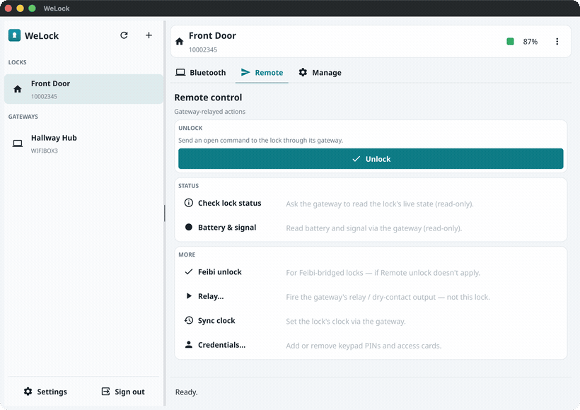
  <br><sub><b>Remote unlock</b> — one click relays the command through the gateway and confirms the result.</sub>
</p>

<p align="center">
  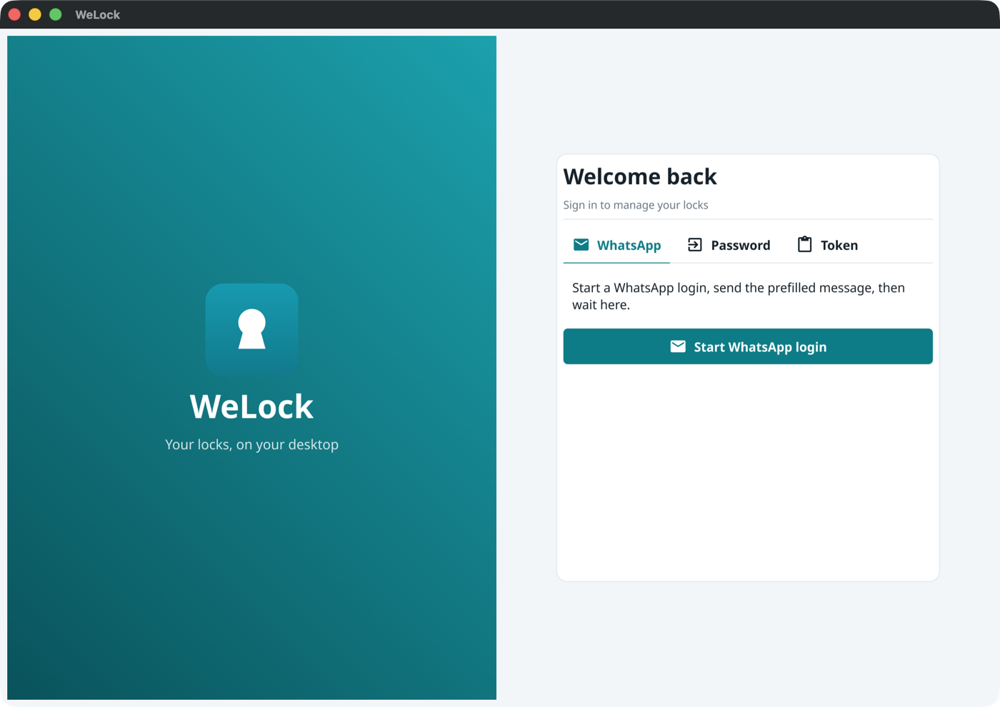
</p>

<table>
<tr>
<td width="50%">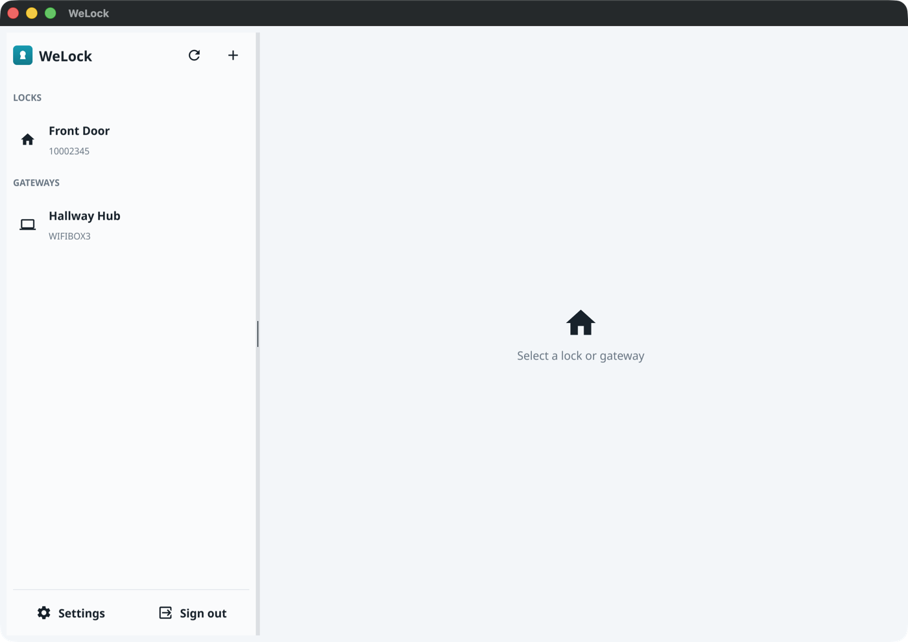<br><sub><b>Your locks &amp; gateways</b> — a branded master-detail rail.</sub></td>
<td width="50%">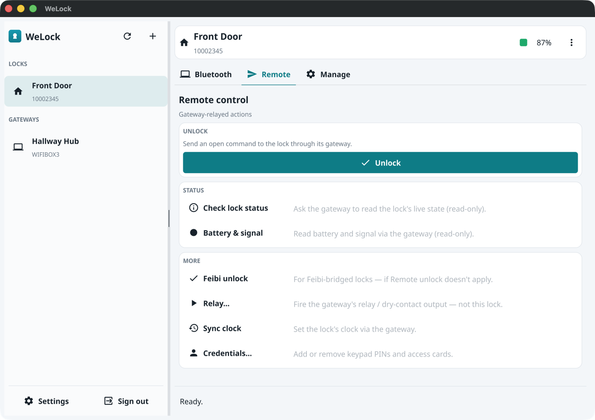<br><sub><b>Remote control</b> — unlock through a paired gateway.</sub></td>
</tr>
<tr>
<td>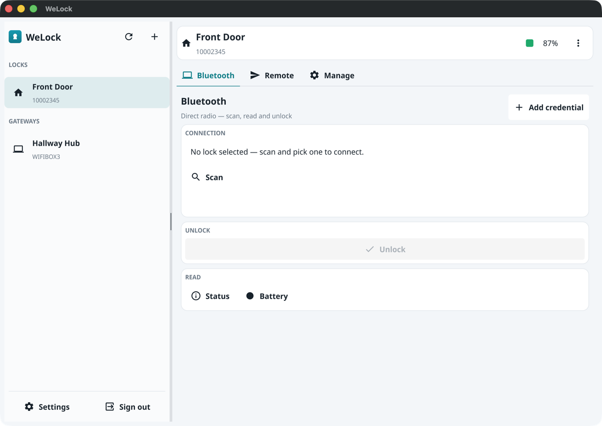<br><sub><b>Bluetooth</b> — scan, connect and unlock over the radio.</sub></td>
<td>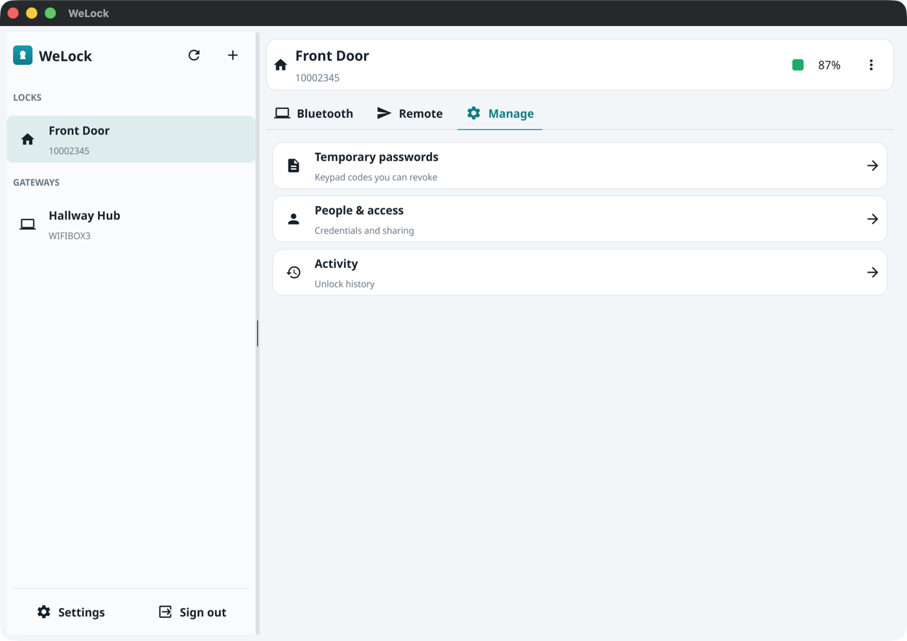<br><sub><b>Manage</b> — drill in to passwords, people and activity.</sub></td>
</tr>
<tr>
<td>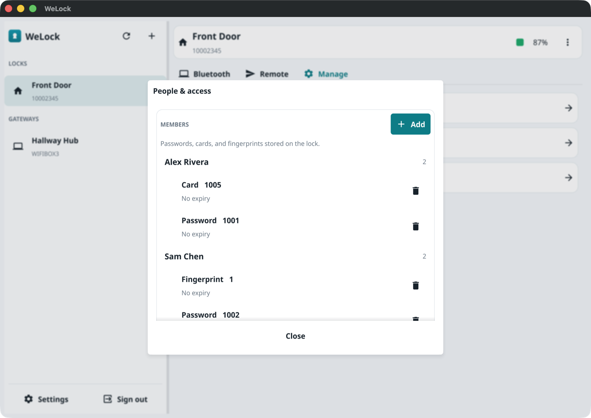<br><sub><b>People &amp; access</b> — credentials grouped by user.</sub></td>
<td>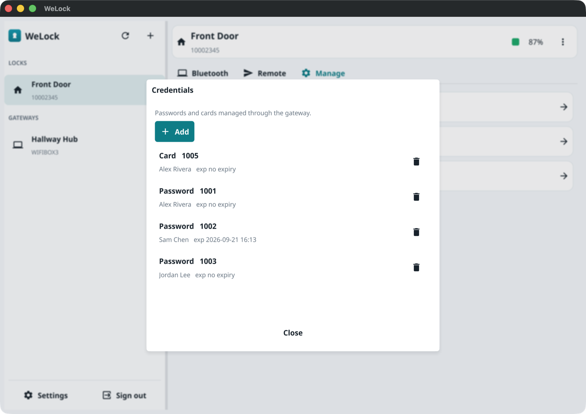<br><sub><b>Gateway credentials</b> — add/remove keypad PINs &amp; cards.</sub></td>
</tr>
<tr>
<td>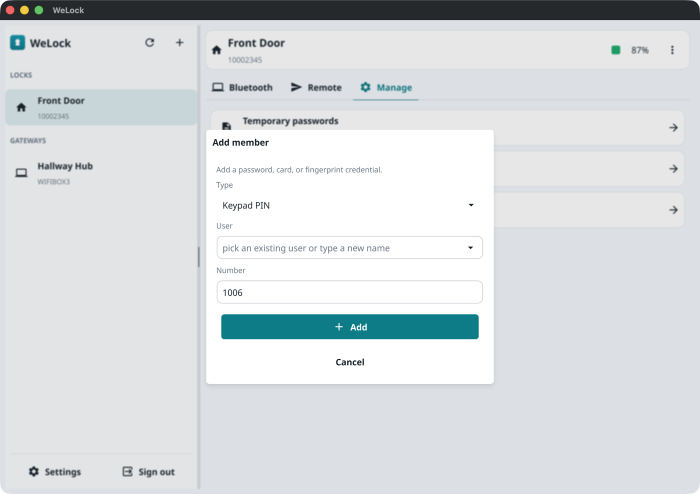<br><sub><b>Add a credential</b> — pick a user, number auto-filled.</sub></td>
<td>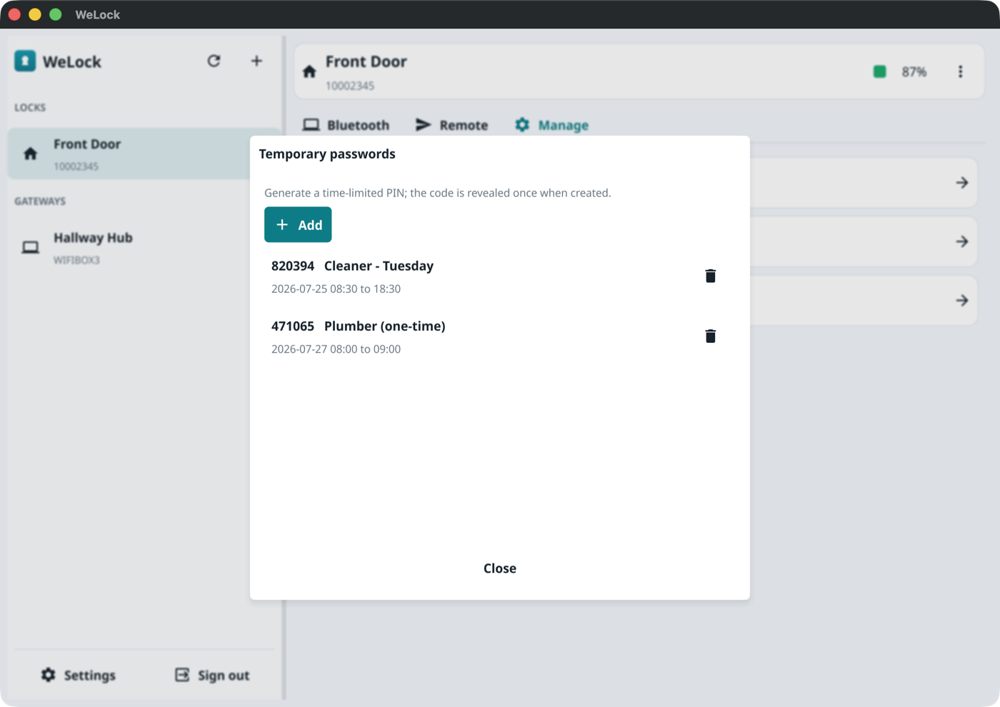<br><sub><b>Temporary passwords</b> — time-limited keypad codes.</sub></td>
</tr>
<tr>
<td>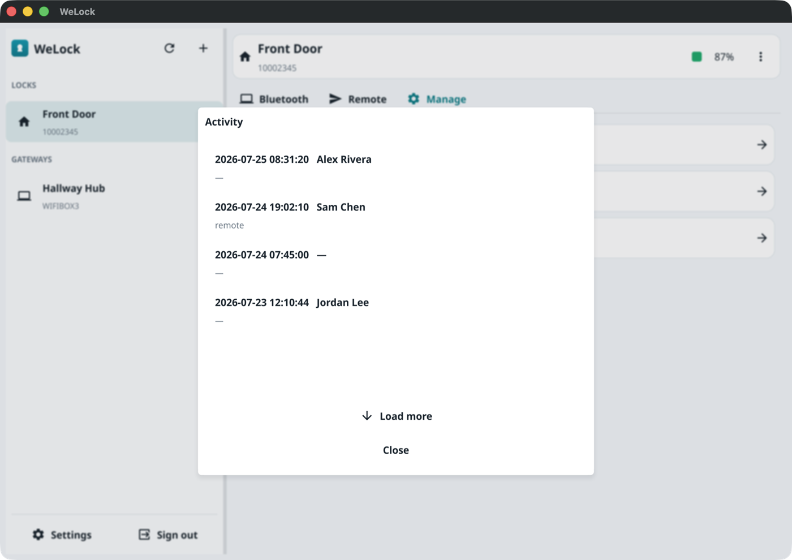<br><sub><b>Activity</b> — the lock's unlock history.</sub></td>
<td>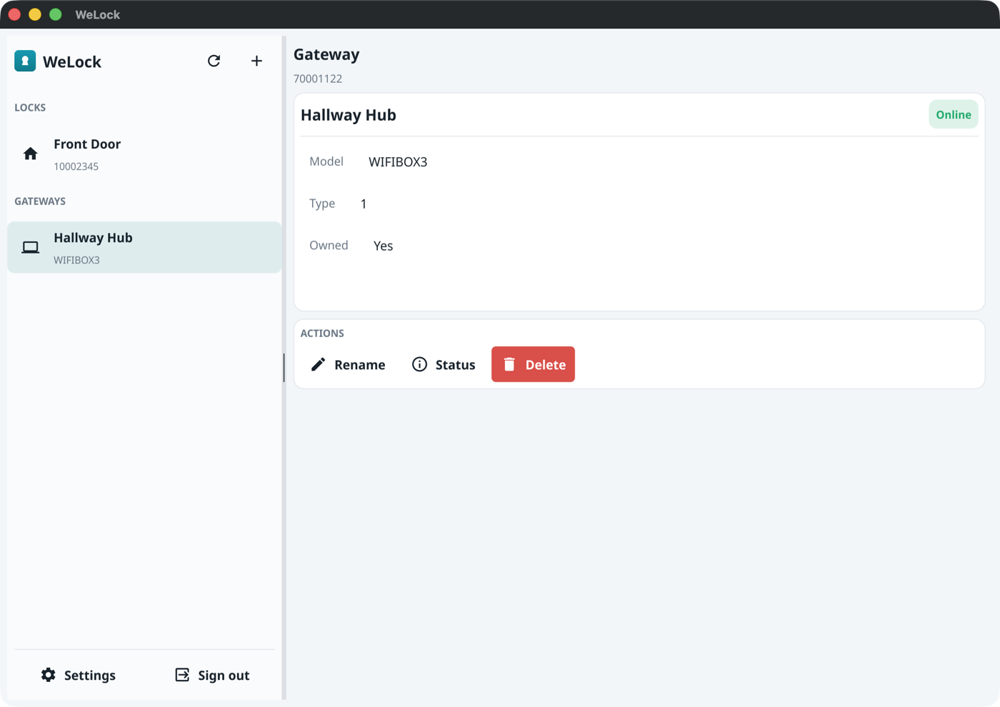<br><sub><b>Gateway</b> — status, rename and remove.</sub></td>
</tr>
<tr>
<td>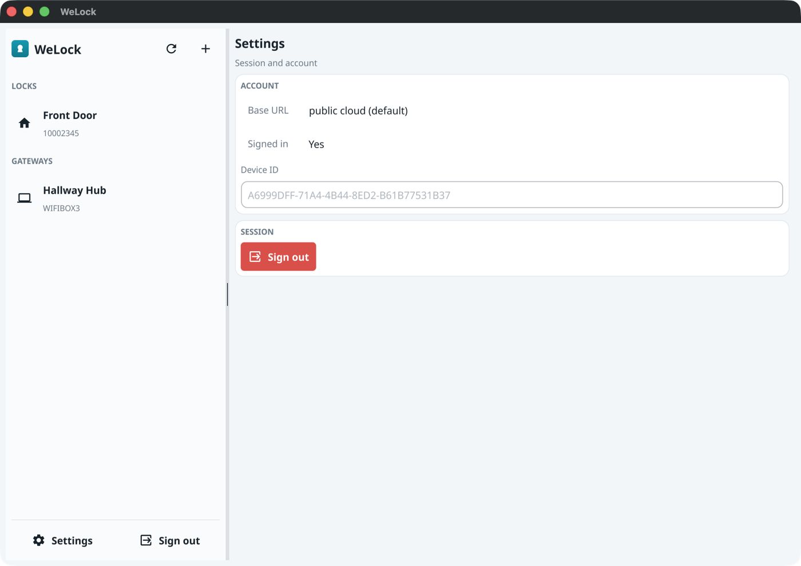<br><sub><b>Settings</b> — account and session.</sub></td>
<td>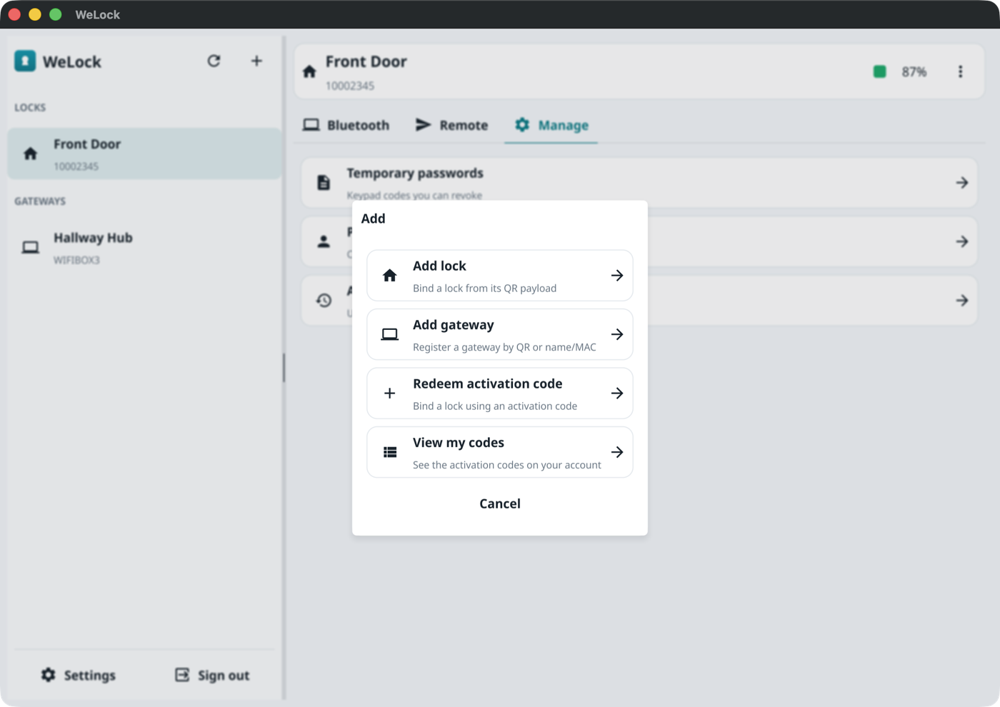<br><sub><b>Add</b> — a lock, a gateway, or an activation code.</sub></td>
</tr>
</table>

<sub>Regenerated from anonymized mock data with one command — see <a href="tools/screenshots/">tools/screenshots/</a>.</sub>

## Features

- **Sign in** with WhatsApp or your account and password.
- **Your locks & gateways** in a master-detail layout with a live battery meter.
- **Bluetooth** — scan, connect, and unlock directly over the radio, and read status & battery.
- **Remote** — unlock through a paired gateway, read lock status, and program keypad PINs,
  cards and fingerprints.
- **Manage** — rename a lock, create temporary passwords, manage people & permissions, and
  browse unlock history.
- **Add** a lock or a gateway in a couple of clicks.

## Install

Download the latest build for your platform from the [Releases](../../releases) page:

- **macOS** — the app isn't notarized yet, so on first launch **right-click `WeLock.app` → Open**
  (not a double-click) and confirm. If macOS still says it "is damaged", clear the download
  quarantine and open it:
  ```bash
  xattr -dr com.apple.quarantine /path/to/WeLock.app && open /path/to/WeLock.app
  ```
  Then allow Bluetooth when prompted.
- **Windows 10+** — run `WeLock.exe` (SmartScreen may warn on an unsigned build → *More info → Run anyway*).

## Building from source

Everything needed to build is in this repo. The shared **engine** that powers
all WeLock clients ships here as a compiled, opaque helper binary the app embeds and runs —
the same way a web client ships a prebuilt wasm module. No private access, tokens, or
extra setup required:

```bash
go run -tags tinygobt .   # native Bluetooth (recommended)
go run .                  # UI only, Bluetooth stubbed
```

Packaging into a native `WeLock.app` / `WeLock.exe` is automated in CI on a `v*` tag.

<sub>The engine binaries under <code>internal/app/sidecar/bin</code> are regenerated on a core bump with <code>tools/build-sidecar.sh</code> — the only step that needs the engine source.</sub>

## Privacy & security

Your access tokens are stored locally in your user config folder with owner-only
permissions, and are never shared or committed. WeLock accounts are **single-session** —
signing in on the official app signs this client out.

### Anonymous usage analytics

Official release builds include **anonymous** product analytics (Amplitude, US region) so
we can see how many people use the app, retention, and which features get used. What is
sent: a random per-install id, the app version, the OS, and coarse event names (app opened,
unlock, credential added — with a `transport`/`kind` label, never a value). What is **never**
sent: your account, phone, tokens, lock names or ids, or any PIN / card / fingerprint.

It is **on by default in official releases** and you can turn it off any time in
**Settings → Privacy**. Builds from source (and any fork/PR build) carry no analytics key
at all, so they send **nothing** — the key is injected only into official release binaries.
